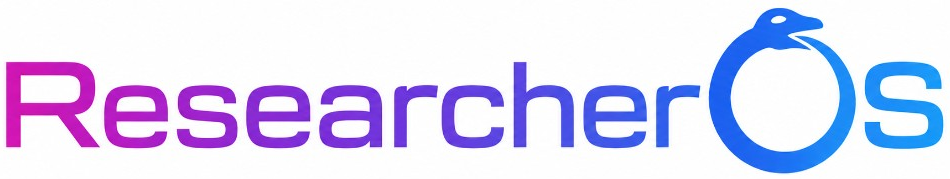

<p align="center">
  
</p>

## About

ResearchOS is a research organization platform built around knowledge extraction: from a problem and hypothesis tree, through kanban experiments and structured reports, to verdicts and insights that accumulate in a curated knowledge base.

```
Problem → causes (nature hypotheses) → hypotheses (how to prove / fix)
  → verification methods → kanban experiment cards
  → report → verdict + insights → knowledge base
```

All research data lives in Markdown files — no database required. The engine is this repository (`koi/`, `api/`, `web/`, `agents/`). Projects are sibling directories marked by `koi-structure/project.md`; experiment code lives in `projectcode/` (or a custom `code_root`).

| Docs | |
|------|---|
| Getting started walkthrough | [docs/human/getting-started.md](docs/human/getting-started.md) |
| Project format | [docs/human/project-format.md](docs/human/project-format.md) |
| Agent instructions | [AGENTS.md](AGENTS.md) |

## News

| Date | What shipped |
|------|----------------|
| 2026-07-16 | **Composite merge by title** — shared ancestors match on `(type, normalized title, parent)`, not only id; remaps child/board links. Fixes duplicate problem/cause branches in ResearchOS and Hub. ADR: [docs/adr-002-composite-view.md](docs/adr-002-composite-view.md). |
| 2026-07-15 | **DAG layout JSON** — card positions in DAG view persist to `koi-structure/dag-layouts/<board_id>.json` (API `GET/PUT /projects/{id}/boards/{board_id}/dag-layout`); browser `localStorage` is migrated on first open. |
| 2026-07-13 | **Method board DAG view** — optional `depends_on` prerequisite edges between experiment cards; Kanban/DAG tabs in the method modal; interactive editor (link, delete, auto-layout, tag filter, Q/A pills, fit-to-view); card status styling (backlog, running pulse, done checkmark); persisted as `deps:` in `project.md`; API `POST /projects/{id}/boards/{board_id}/dag/suggest`. |
| 2026-07-03 | **Composite view** — projects with the same `composite_id` merge into one hypothesis tree at read time; virtual program entry in the sidebar; writes route to the owning repo via `node.project_id`. API: `GET /composites`, `GET /composites/{id}`. ADR: [docs/adr-002-composite-view.md](docs/adr-002-composite-view.md). |
| 2026-07-02 | Kanban **Successful** column (`successful`) — 4th column after Done for confirmed experiments; `done` stays the agent/report terminal state; auto-migration of `project.md` on load. |
| 2026-07-01 | Open-source release on GitHub (`main` = engine, `test_project` = demo sample). |
| 2026-07-01 | Orphan-branch sync — `koi-structure/` can live on a dedicated git branch (`koi/research` or custom) while your code branch stays clean. CLI: `python -m koi.projects.sync_cli init-sync-branch`. |
| 2026-07-01 | Stable local serve — `koi-serve.sh` works reliably on macOS; web port proxies `/api` so one URL is enough. |
| 2026-07-01 | Live card view — real-time experiment activity on kanban cards; refreshed method-activity UI. |
| 2026-07-01 | Report & knowledge fixes — reliable card report loading; repo `docs/*.md` served via knowledge API. |
| 2026-06-23 | Demo project — `bicycle_problem` sample (search-ad budget efficiency) for onboarding. |

## Installation

Requirements: Python 3.10+, `git`, `curl`. Optional: [tectonic](https://tectonic-typesetting.github.io) or `pdflatex` for NeurIPS PDF export.

### Clone

```bash
git clone git@github.com:ZoyaV/ReseacherOS.git ReseachOS
cd ReseachOS
```

### Option A — conda (recommended)

```bash
conda create -n researchos python=3.11 -y
conda activate researchos
pip install -r requirements.txt
pip install -r requirements-dev.txt   # optional, for tests
```

### Option B — venv

```bash
python3 -m venv .venv
source .venv/bin/activate          # Windows: .venv\Scripts\activate
pip install -r requirements.txt
```

### Start

```bash
./scripts/koi-serve.sh start
./scripts/koi-serve.sh status
```

| Service | URL |
|---------|-----|
| Web UI | http://127.0.0.1:8080 |
| API (Swagger) | http://127.0.0.1:8010/docs |

`koi-serve.sh` creates `.venv` if missing, installs dependencies, and downloads tectonic to `.tools/tectonic` when needed.

```bash
./scripts/koi-serve.sh stop      # stop
./scripts/koi-serve.sh restart  # restart
```

Settings and API keys — Settings button in the UI, or `.env` in the repo root (gitignored; see `.env.example`).

### Try the demo project

The sample project lives on orphan branch `test_project`. Check it out as a sibling worktree:

```bash
cd ..                              # parent of ReseachOS/
git -C ReseachOS worktree add bicycle_problem test_project
./ReseachOS/scripts/koi-serve.sh restart
```

Open http://127.0.0.1:8080 — `bicycle_problem` appears in the sidebar.

## Add a project

ResearchOS scans the parent directory of the engine and discovers every folder with `koi-structure/project.md`. Extra roots: `KOI_SCAN_ROOTS=/path/a,/path/b`.

```
workspace/                    # any parent folder name
├── ReseachOS/                # engine (this repo)
├── my_experiment/            # your project
│   ├── koi-structure/        # ← ResearchOS reads/writes here
│   │   ├── project.md        # hypothesis tree + kanban
│   │   ├── research.json     # experiment conclusions
│   │   ├── reports/            # card reports
│   │   └── knowledge/          # curated KB docs
│   ├── projectcode/          # ← experiment code
│   └── .git/                 # your project repo
└── bicycle_problem/          # demo (optional worktree)
```

### Attach an existing code repository

Use this when you already have a git repo with experiment code and want ResearchOS to manage `koi-structure/` on a separate orphan branch.

Layout: clone or place your repo as a sibling of `ReseachOS/`. Add `koi-structure/project.md` (minimal frontmatter below).

Agent prompt — paste into Cursor / Claude Code; the agent should follow skill
`koi-project-onboard` (Socratic tree + prose) and finish with orphan sync via
`koi.projects.sync_cli` (same steps as skill §6c):

```
Подключи <path-to-my-repo> к ResearchOS (attach + orphan-branch sync).

Context:
- Engine: ../ReseachOS/ (or absolute path to this ResearchOS clone)
- My project repo: <path> (sibling of ReseachOS/)
- Research data: <repo>/koi-structure/
- Sync branch default: koi/research

Follow agents/skills/koi-project-onboard/SKILL.md end-to-end, including §6c:
init-sync-branch + push koi-structure to the orphan branch; on the code branch
gitignore koi-structure/ and related worktree dirs. Do not change git config.
Do not commit secrets (.env).

If init-sync-branch reports "exists", the remote branch is already there — see next section.
```

Manual CLI (same result):

```bash
cd ReseachOS
python -m koi.projects.sync_cli init-sync-branch --project-id <your-project-id>
```

### Sync branch already exists

If someone on your team (or CI) already created the orphan branch — e.g. `koi/research`, `test_project`, or a custom name — you only need to point your code branch at it.

In `koi-structure/project.md` on your working branch:

```yaml
---
id: my-project
title: My Research Problem
format: koi/1
git_repo: true
git_sync_branch: koi/research    # ← must match the existing orphan branch
---
```

Then pull research data into your working tree:

```bash
cd ReseachOS
python -m koi.projects.sync_cli pull --project-id my-project
```

Ongoing sync: UI Sync button, skill `koi-project-sync`, or:

```bash
python -m koi.projects.sync_cli push --project-id my-project
python -m koi.projects.sync_cli pull --project-id my-project
```

### Start from scratch (no repo yet)

#### Option 1 — Agent interview

Paste into your IDE agent:

```
Create a new ResearchOS project from scratch.

1. Interview me: research problem, domain, what we already know, what experiments are feasible.
2. Propose a hypothesis tree: problem → causes → evidence/remediation hypotheses → methods.
3. Ask for a folder tag (latin slug, e.g. protein_folding).
4. Create sibling directory parent(ReseachOS)/<tag>/ with:
   - koi-structure/project.md (frontmatter + tree nodes)
   - koi-structure/research.json
   - projectcode/README.md
5. If I want git sync, init a git repo there, set git_repo: true, run init-sync-branch.
6. Restart ./scripts/koi-serve.sh and tell me to open the UI.

Follow koi-prose-style for all user-facing text. Do not commit without my explicit ask.
```

#### Option 2 — Build the tree in the UI

1. Open http://127.0.0.1:8080
2. Expand the project sidebar (`<` / `>` chevron)
3. Click "+ New project"
4. Fill in: Title, Description, Tag (folder name), Program
5. Click Create

The UI creates `parent(ReseachOS)/<tag>/` with `koi-structure/` and `projectcode/` automatically. A Problem node appears on the map.

| Next step | Where |
|-----------|-------|
| Add cause / hypothesis / method | Dashed "+" under a node on the map |
| Edit a node | Click node → Edit |
| Create an experiment | Click method → kanban → + in a column |
| Write a report | Click kanban card → report editor |
| Ask the agent | Node panel or workspace chat button |

Where to write code: `projectcode/` (not inside `koi-structure/`).  
Where research lives: tree + kanban in UI or `koi-structure/project.md`; reports in `koi-structure/reports/`.

## Platform overview

| Area | Highlights |
|------|------------|
| Hypothesis map | Radial tree: problem → cause → evidence / remediation → method |
| Kanban | Per-method backlog / running / done / successful columns |
| Reports | Structured experiment reports with ingest → verdicts + insights |
| Knowledge base | Auto-built from reports; curator skill for deep synthesis |
| Related work | Literature search and review generation |
| Paper export | NeurIPS LaTeX → PDF from the full project graph |
| Agent skills | `agents/skills/koi-*` — card execution, sync, review, chat, paper |

## Links

| | |
|---|---|
| Public site (GitHub Pages) | [docs-site/](docs-site/) → after deploy: `https://zoyav.github.io/ReseacherOS/` |
| Documentation | [docs/](docs/) |
| Issues | [github.com/ZoyaV/ReseacherOS/issues](https://github.com/ZoyaV/ReseacherOS/issues) |
