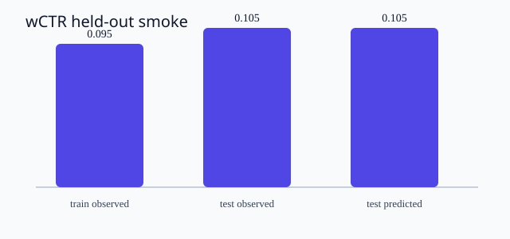
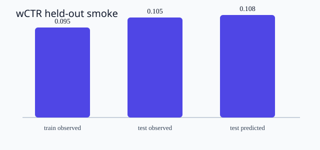

# Evo live stream

> Обновлено: 2026-09-02T10:48:49.209573+00:00
> Это рабочий поток Evo, не финальный научный verdict.

## Идеи Evo

**Текущая идея:** Iteration 2: light smoothing

### `exp_0000` — Run held-out wCTR benchmark
- Статус: `pending`
- Ветка: `evo/run_0000/exp_0000`
- Score: `—`
- Worktree: `/Users/zoya/projects/research/ReseachOS/tree/bicycle_problem/.evo/run_0000/worktrees/exp_0000`

### `exp_0001` — Evaluate held-out wCTR without leakage
- Статус: `committed`
- Ветка: `evo/run_0000/exp_0001`
- Score: `-0.3294151018906866`
- Worktree: `/Users/zoya/projects/research/ReseachOS/tree/bicycle_problem/.evo/run_0000/worktrees/exp_0001`

### `exp_0002` — Evaluate held-out wCTR without leakage
- Статус: `committed`
- Ветка: `evo/run_0000/exp_0002`
- Score: `-0.3294151018906866`
- Worktree: `/Users/zoya/projects/research/ReseachOS/tree/bicycle_problem/.evo/run_0000/worktrees/exp_0002`

### `exp_0003` — Try unsmoothed segment rates
- Статус: `evaluated`
- Ветка: `evo/run_0000/exp_0003`
- Score: `-0.32942713052846834`
- Worktree: `/Users/zoya/projects/research/ReseachOS/tree/bicycle_problem/.evo/run_0000/worktrees/exp_0003`

### `exp_0004` — Try stronger smoothing
- Статус: `evaluated`
- Ветка: `evo/run_0000/exp_0004`
- Score: `-0.32967138464657925`
- Worktree: `/Users/zoya/projects/research/ReseachOS/tree/bicycle_problem/.evo/run_0000/worktrees/exp_0004`

### `exp_0005` — Iteration 1: no smoothing
- Статус: `committed`
- Ветка: `evo/run_0000/exp_0005`
- Score: `-0.3295482171703249`
- Worktree: `/Users/zoya/projects/research/ReseachOS/tree/bicycle_problem/.evo/run_0000/worktrees/exp_0005`

### `exp_0006` — Iteration 2: light smoothing
- Статус: `committed`
- Ветка: `evo/run_0000/exp_0006`
- Score: `-0.32942713052846834`
- Worktree: `/Users/zoya/projects/research/ReseachOS/tree/bicycle_problem/.evo/run_0000/worktrees/exp_0006`

## Решения и проверки

**Текущий кандидат:** Кандидат `exp_0006`; статус `committed`; score `-0.3294151018906866`; пройдено проверок: `18`

- `exp_0000`: **failed**; score `—`
- `exp_0000`: **passed**; score `-0.3294151018906866`
- `exp_0000`: **passed**; score `—`
- `exp_0001`: **passed**; score `-0.3294151018906866`
- `exp_0001`: **passed**; score `—`
- `exp_0001`: **passed**; score `-0.3294151018906866`
- `exp_0001`: **passed**; score `—`
- `exp_0002`: **passed**; score `-0.3294151018906866`
- `exp_0002`: **passed**; score `-0.3294151018906866`
- `exp_0002`: **passed**; score `-0.3294151018906866`
- `exp_0002`: **passed**; score `-0.3295482171703249`
- `exp_0003`: **passed**; score `-0.3294151018906866`
- `exp_0003`: **passed**; score `-0.3294151018906866`
- `exp_0003`: **passed**; score `-0.3294151018906866`
- `exp_0003`: **passed**; score `-0.32942713052846834`
- `exp_0004`: **passed**; score `-0.3294151018906866`
- `exp_0004`: **passed**; score `-0.3294151018906866`
- `exp_0004`: **passed**; score `-0.3294151018906866`
- `exp_0004`: **passed**; score `-0.32967138464657925`

## Заметки Evo

Заметок пока нет.

## Графики и артефакты

- 
- 
- 
